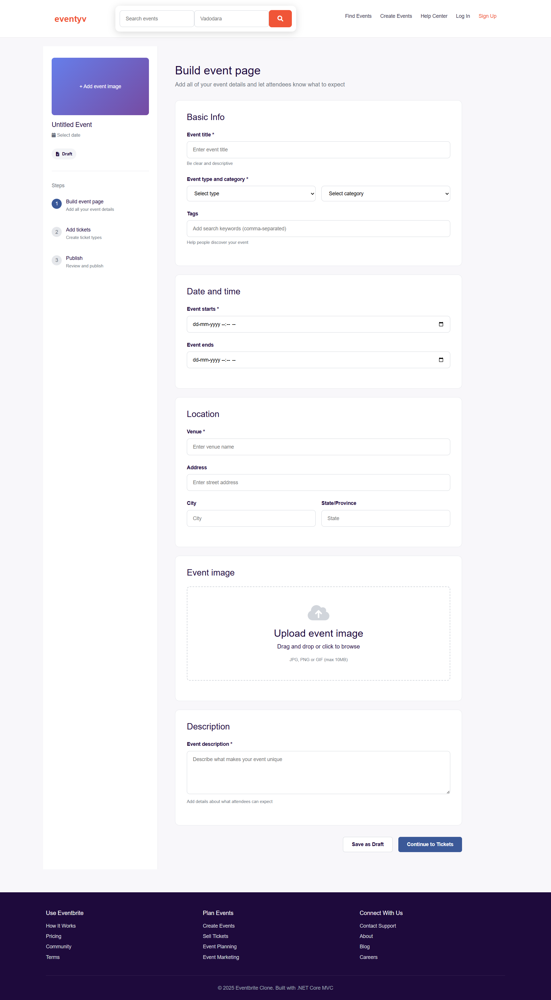

# 🎉 Eventyv — Event Management Web Application (.NET)

Eventyv is a **production-ready event management web application** built using **ASP.NET Core (.NET)**.  
The project demonstrates **clean architecture, backend development skills**.

> Designed to showcase real-world .NET development and cloud-ready practices.

---

## 🚀 Key Highlights

- ✅ Built with **ASP.NET Core (.NET)**
- ✅ Clean MVC / Web API architecture
- ✅ Scalable & maintainable codebase

---

## 🛠 Tech Stack

- **Backend:** ASP.NET Core (.NET)
- **Language:** C#
- **Architecture:** MVC / REST API
- **Database:** SQL Server
- **Authentication:** ASP.NET Identity
- **Version Control:** Git & GitHub

---

## 🖼️ Screenshots

### 🔐 Login Page
<p align="center">
  
</p>

### 📝 Sign Up Page
<p align="center">
  
</p>

### 🏠 Home Page
<p align="center">
  
</p>

### 🔍 Find Event
<p align="center">
  
</p>

### 📄 Event Details
<p align="center">
  
</p>

### ➕ Create Event
<p align="center">
  
</p>

---

## ⚙️ Run Locally

```bash
git clone https://github.com/RohitManvar/eventyv.git
cd eventyv
dotnet restore
dotnet run


